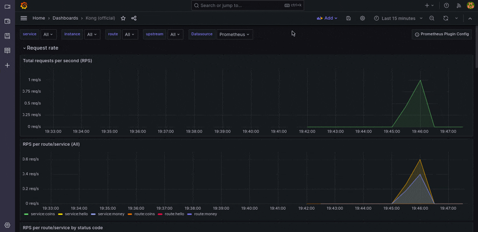

# Introduction

This repository demonstrates how to retrieve metrics from the loved Api Gateway (Kong) using the default Grafana Dashboards.

On a daily basis, this is useful for capturing real-time data in your production environment.

# How to run tests?

A number of containers will be running concurrently:

- Kong 
- Prometheus
- Grafana 
- Nginx (local server)
- Traefik Whoami (used for upstream metric generation)
- Seed (used to produce metrics by making queries)


```shell
docker compose up -d
```

# Kong

- Hello Route [http://localhost:8000/]
- Whoami Route [http://localhost:8000/whoami]
- Coins Route [http://localhost:8000/coins]
- Money Route [http://localhost:8000/money]
- Kong Admin url: [http://localhost:8001]
- Metrics url used by Prometheus: [http://localhost:8100/metrics]
- Grafana url: [http://localhost:9091]
 
 # Prometheus

 Prometheus is in charge of scraping metrics from Kong every specified number of seconds, checkout file [prometheus.yml](./prometheus/prometheus.yml)

 - Prometheus url: [http://localhost:9090]

# Grafana

Grafana is in charge of converting data sources metrics (prometheus, statsd, and others) into stunning Dashboards and Alerts, such as this:



# How run seeds ?

```shell
# if you want to send more requests:
docker compose run --rm seed --env REQUESTS=11
```

# Importing Kong Official Dash.

You should import [kong_official.json](./assets/grafana/kong_official.json) on Dashboard > Manager > Import.

References:

- [Kong Grafana Dashboard](https://grafana.com/grafana/dashboards/7424-kong-official/?tab=revisions)
- [Kong Prometheus Plugin](https://docs.konghq.com/hub/kong-inc/prometheus/)

# Grafana 

Default and secure credentials 🤣: 
    - admin/admin